**Note:** This repository contains the Azure infrastructure code managed with Terraform. It provisions the required cloud resources, including networking, Azure Kubernetes Service (AKS), Azure Container Registry (ACR), and storage components.  
The application source code, Docker configuration, and CI/CD pipeline for building and pushing container images are maintained separately.  
For the application repository, please visit: **[Application Repository](https://github.com/birrkan/azure-aks-terraform-nginx-APP-REPO)**

# **Project Architecture and Design**

### **Overview of the Project**

This project demonstrates an end-to-end DevOps workflow for deploying a containerized web application to Microsoft Azure. A simple .NET application is packaged into a Docker container and automatically built and pushed to Azure Container Registry through a GitHub Actions CI/CD pipeline. The required Azure infrastructure, including networking, storage, container registry, and Azure Kubernetes Service (AKS), is provisioned using Terraform as Infrastructure as Code. Once deployed, AKS retrieves the container image from ACR and runs the application in a Kubernetes environment, creating a fully automated pipeline from source code to cloud deployment.

---

### **High-Level Architectures**

-   Tfstate files are stored inside blob storage. Terraform gains access
    to the storage account where the blob storage is located via storage
    account access key from the key
    vault: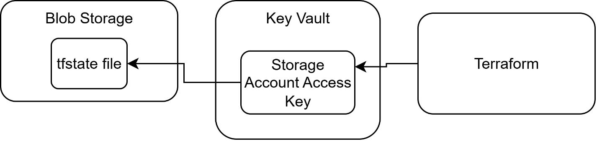

-   Built application images (docker images) are pushed to Azure
    container registry which is connected to AKS. AKS pulls the images
    from ACR to update its current deployment configuration with the new
    image: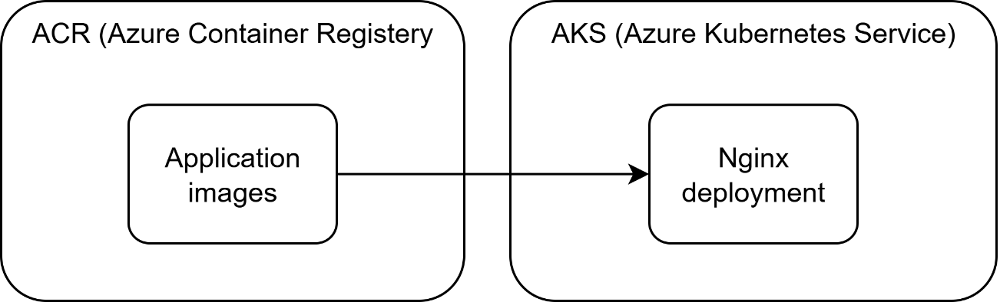

-   The process can also be visualized for the pipelines. Infrastructure
    pipeline provisions the infrastructure and application pipeline uses
    the provisioned resources to deploy the application:

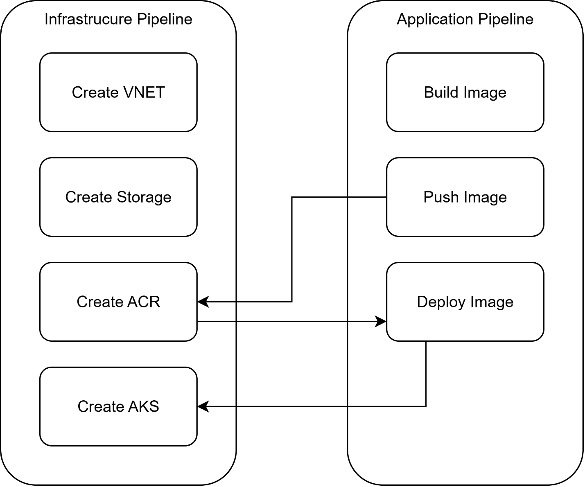

# **Implementation Details**
### **Overall Terraform Structure:**

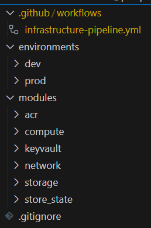
In this project I am considering a clean directory structure for the terraform code. I am separating development and
productions environments, which will be triggered for deployment
depending on the git branches the code is being pushed to.

These environment folders hold the main terraform files: backend, main,
variables, providers and outputs.tf

-   Main.tf: is the main file containing the core resource definitions
    and orchestration logic for the infrastructure. This is where I
    outline the fundamental components of the infrastructure I am
    deploying such as networking, compute and storage. For my modular
    and structured approach, this file calls modules from my modules
    directory.

> Main.tf file calls the modules in the order they appear as in the file
> unless it is specified with dependencies.
>
> The first module called "network" calls my network module from the
> modules folder.

-   Backend.tf: This file configures where and how Terraform stores its
    state. In my project this state files are stored in a separate Azure
    Blob Storage.

Managing the state remotely prevents conflicts when multiple users run
deployments concurrently. What happens is, when one user is deploying
the terraform code, they gather a lock. During this time terraform state
is locked for other users until the current user finishes their
deployment and releases the lock automatically. This way possible
conflicts of the infrastructure definition is avoided.

-   Variables.tf: This is the file where I store all the variables and
    their definitions to avoid hard coded values in the configuration
    files themselves.

-   Dev.auto.tfvars / Prod.auto.tfvars: This is the file where the
    values of the variables in the variables.tf are stored at. There are
    two versions of the same file both in development and production
    environments. This way, we can easily modify the values depending on
    the environment.

-   Providers.tf: In this file, we declare and configure the providers
    that Terraform will use. For instance, when we are deploying on
    Azure, this file will include the required provider configurations
    like credentials, regions, and API endpoints. It sets the foundation
    for how Terraform interfaces with external services.

-   Outputs.tf: This file defines the outputs for our terraform run.
    Outputs are useful for exposing key information of our deployments
    such as resource IDs and URLs. We are able to see these outputs when
    we are running our terraform code.

### **The script Store-tfstate.sh:**

Before I run my terraform configuration, I need to run a script to set
up the storage account and key-vault for my infrastructure. The reason
why I am not doing this step is to avoid circular dependency issue. For
creating a tfstate file I need a storage account already created but if
the creation of storage account inside terraform, that means I will not
be able to make use of tfstate file.

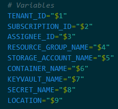In the script, I am first pulling my
variables from Github repo's secrets vault. This method ensures that I
don't have any hardcoded values in my code for the best security
practices. Then I proceed with creation of storage account and key
vault. I do the checks on each step to ensure whether the resource
already exists. If the resource exists it skips the command, if not it
proceeds with the creation of the resource.

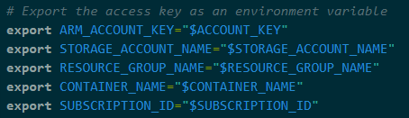

After the creation of the resources, I am exporting the values from the
created resources such as their names and keys as environment variables.
These environment variables will be used later in the CI/CD pipeline.

### **Terraform Modules**

In this project I will be mainly using Azure provided modules. By using
official modules we get ourselves free from maintaining the modules.
This approach reduces the risk of new security threats by keeping the
modules automatically up to date.

#### **Network module**

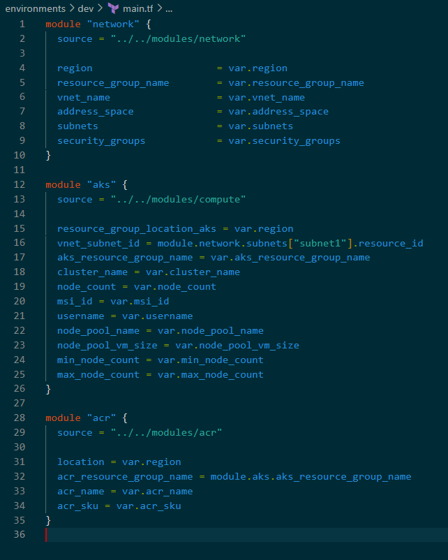

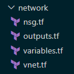
In my modules/network folder I have 4
files. Vnet.tf is responsible for creating the virtual networks while
nsg.tf creates the security gorups. Variables include the variable
definitions and outputs include the outputs I specify that would be
gathered after the module is run. We use outputs for debugging but also
making it possible for other modules or files to be able to use them.

The network module is a Terraform configuration that provisions the
fundamental networking components required for the cloud infrastructure.
Its primary components include the creation of a resource group, virtual
networks (VNet) along with their associated subnets, and network
security groups (NSGs) with detailed security rules.

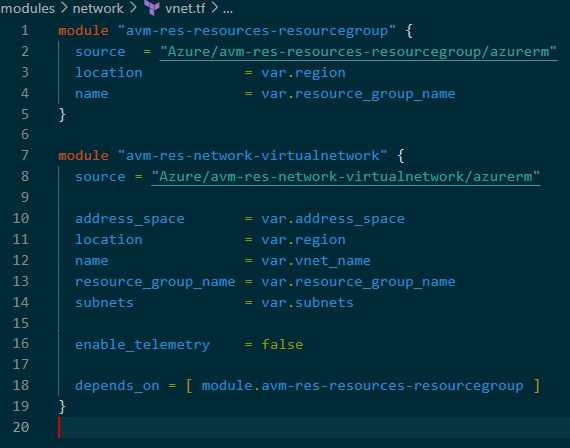

I will be considering and practicing the best modularity and security in
my approach.\
In the file vnet.tf I am first creating a resource group for my project.
Creating a resource group is a good practice to separate our resources
in groups for making the management easier for us.

Inside the resource group I am creating my Virtual Network as my first
resource.\
This module requires critical inputs such as the address space (CIDR
blocks), location, virtual network name, and a map of subnets. The
subnets themselves are defined as a map of objects, where each subnet is
configured with its own properties like name and address prefixes.

Subnetting is the process of dividing a larger IP address range (CIDR
block) into smaller, more manageable segments called subnets. When
creating a Virtual Network (VNet) in Azure, subnetting is an essential
step. Each subnet within a VNet represents a logical partition of the
network and is used to segment resources for security, performance, and
management.\
By subnetting we are able to create public and private subnets. This
separation becomes crucial when some segments/resources of our
application does not need the same level of exposure to the outside
internet.

The module uses a depends_on clause to ensure that the resource group is
fully provisioned before attempting to create the VNet, thereby avoiding
dependency and timing issues.

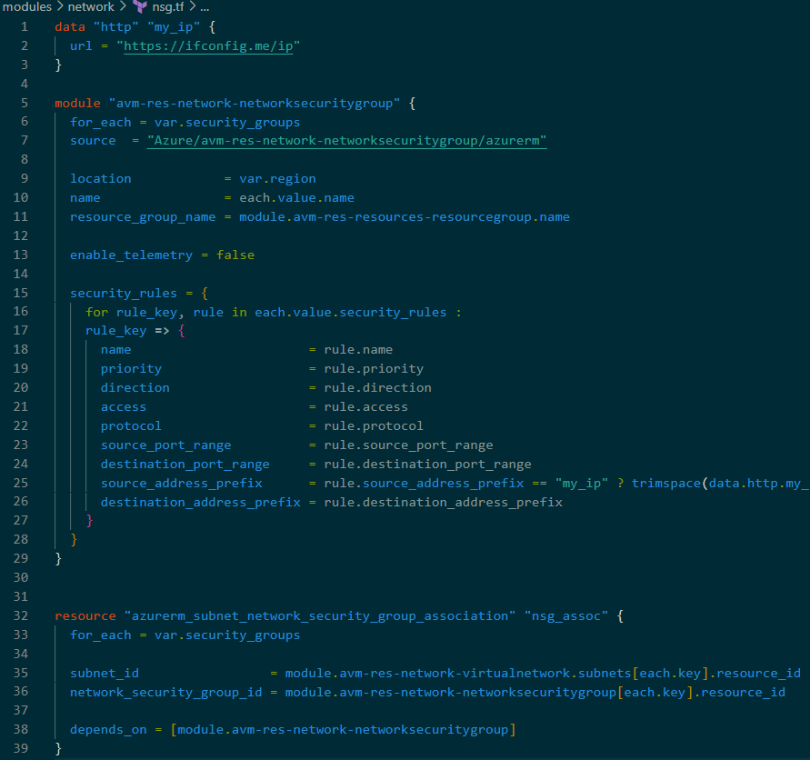

In the file nsg.tf I am creating my security groups for my resources.
This step is crucial for network security for we are defining which
ports and addresses our resources can communicate with. In my
application I am exposing Http and SSH ports of my application. Http
port (80) is set to communicate with all networks while SSH port is open
to my device IP only.

After the creation of my security groups, I am associating them with the
subnets I created earlier.

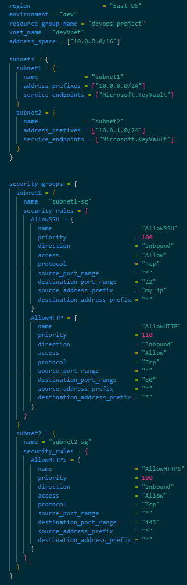

These are the values I have given to my variables for the network module
for the dev environment. These values are in dev.auto.tfvars file.

## COMPUTE MODULE / AZURE KUBERNETES:

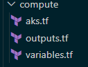In my compute model, I have 3 files: AKS,
outputs and variables.tf

In my AKS.tf file I am once again creating a separate resoruce group for
my compute resources then proceed with creating my kubernetes cluster.

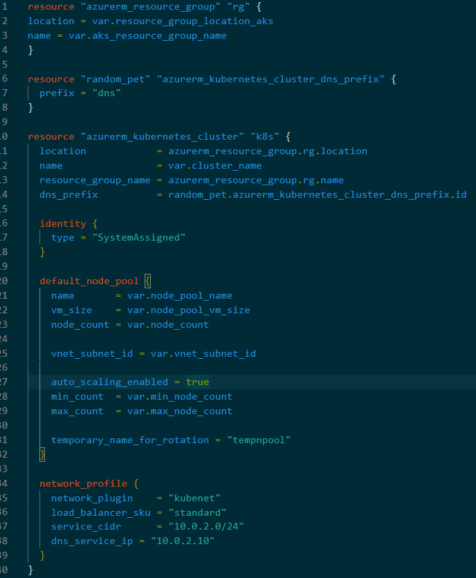

By using the random_pet resource, the module ensures that each AKS
cluster receives a unique DNS prefix. This is to avoid naming conflicts
in Azure, where multiple clusters might be deployed in a shared
subscription or region. The generated DNS prefix is later used by the
cluster resource to construct endpoints for API server communications
and other cluster services.

The resource azurerm_kubernetes_cluster "k8s" is the core resource
provisioning an AKS cluster within the previously created resource
group. It encapsulates essential parameters such as location,
networking, node pool settings, and system identity configuration. I am
using the most basic configuration by module's examples documentation to
avoid complexity.

Default Node Pool:

This section specifies the default pool of nodes (virtual machines) in
the cluster.

Auto Scaling: var.min_node_count and var.max_node_count parameters
define the lower and upper bounds for the number of nodes in the pool,
ensuring cost efficiency and performance scalability. So when the
minimum amount of nodes get overloaded, they are automatically scaled up
to provide more performance for the application up to the upper limit we
set.

Network Profile:

The network_profile block configures how the AKS cluster handles network
communications.

network_plugin parameter is set to "kubenet" to use the Kubernetes'
built-in networking configuration.

These are the values I have given to my variables for AKS module for the
dev
environment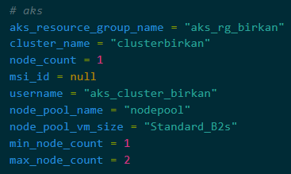
These values are in dev.auto.tfvars file.

#### **STORAGE MODULE / AZURE CONTAINER REGISTERY:**

The ACR module is designed to create an Azure Container Registry
instance that serves as a private registry for storing container images.
We will be using ACR to store our application's built docker image.
While the infrastructure pipeline will only handle the creation of the
ACR, later the application pipeline will build the application image,
push it to ACR, then deploy that image to the AKS we created in the
previous module.

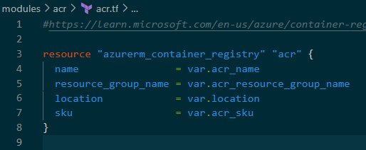

Creating an ACR is a straightforward task. I am using the simple example
from Microsoft documentation to avoid complexity. While creating Azure
Container Registery, it is crucial to create a unique name for it.

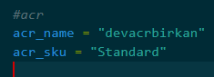These are the values I have given to my
variables for ACR module for the dev environment. These values are in
dev.auto.tfvars file.

## 5.3 AUTOMATION PIPELINES

### INFRASTRUCTURE PIPELINE:

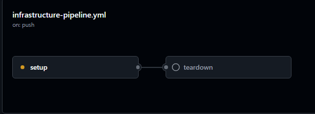

This is the pipeline for deploying my terraform configuration to Azure.

I have two jobs: setup and teardown.

Setup job takes care of initializing, planning and applying the
terraform configuration.

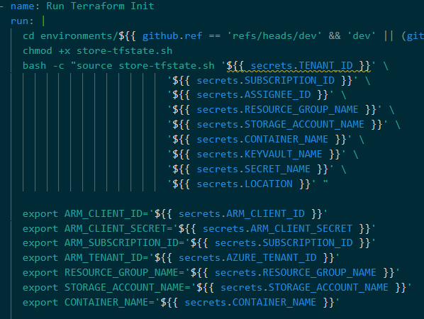

As a first step, to gather the environment variables it runs the
store-tfstate.sh script which handles the creation of storage account
for storing tfstate file and a key-vault. Then exports the values and
secrets of created resources as environment variables. Which will be
used in the next step where I run the terraform commands.\
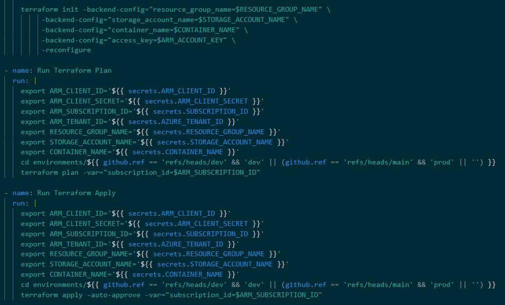

Terraform init sets up the providers and backend for the configuration.
For every step I am using a service provider (SP) instead of my user
account on Azure. This step ensures that the provision is automated and
asks for no manual authentication steps. We can image SP as a user
specifically created to be used in the pipeline with just enough
permissions. In my case it needs the permissions: Key Vault Secrets
Officer and Storage Blob Data Contributor. Using a service provider
instead of the default user account ensures the best security practices.

Terraform plan, checks the current state of the infrastructure and
informs us about the changes we would be applying over to the
infrastructure in the next command, terraform apply.

Terraform apply is the last command for provisioning our Azure
infrastructure, where it applies over our terraform configuration. It
ensures redundancy in our environment. If we have done any manual
changes on the infrastructure, this step reverts every change into what
is specified in the terraform configuration.

In my plan and apply commands I am also checking whether the branch this
pipeline is running is "dev" or "prod". This ensures to use my
configurations and variables from separate folders for separate
environments.

After all these terraform commands are run, my infrastructure on Azure
is ready to be used.

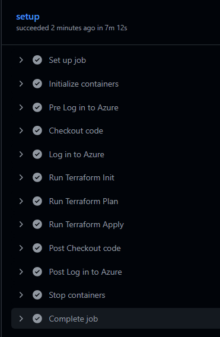Thanks to using infrastructure as code
(IAC) approach, the creation of the whole infrastructure takes
approximately only 7 minutes to be completed. Which would have taken a
lot more time and be prone to mistakes and inconsistencies if done by
manually.

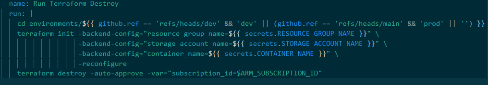

Terraform destroy command is used to automatically destroy the whole
infrastructure that was defined in the terraform configuration.

### APPLICATION & APPLICATION PIPELINE - (dockerfile and Kubernetes deployment):

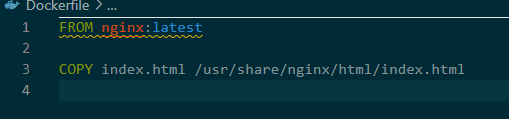

The application I will be hosting on the infrastructure I provisioned on
the previous steps is a simple webpage hosted on nginx. I am using the
official docker image of nginx.

In the pipeline this dockerfile will be built, pushed to ACR and then
deployed into the Kubernetes cluster via deployment file. In the
deployment file (deployment.yaml) we define two kind of kubernetes
resources that is needed to run my nginx page: deployment and service.

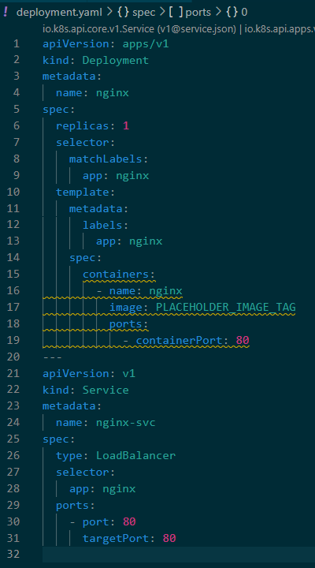**Deployment:**

In the deployment I am creating a template for the image to be deployed.
I set the name of the container as "nginx" while entering a placeholder
for the image. This is to prepare the template for my images in the ACR
where the container name will always be "nginx" and the image will be
tagged every time I make a new build. The image name of the build will
be the Git commit SHA to make sure each image name will be unique.

I am setting the container port as 80 for this project. The port number
80 will be exposed from the container.

I am setting the number of replicas as 1. Number of replicas are the
number of pods we want to create. Not to mistake with the number of
nodes where we set in my AKS module in the terraform configuration with
minimum and maximum values.

**Service:**

In the service resource I am creating a load balancer. Azure will
provision a load balancer to expose the service externally on port 80.

With the selector: app: nginx, we are telling the service which pods to
route the traffic to.

### APPLICATION PIPELINE:

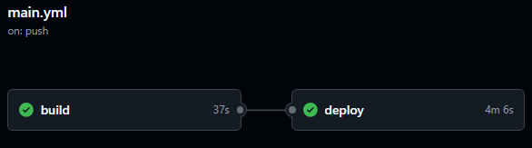

The workflow overview for my application pipeline is to build the docker
image, push it to the ACR we created in the infrastructure setup and
then deploy the deployment to the AKS on Azure.

The pipeline has two jobs: build and deploy:

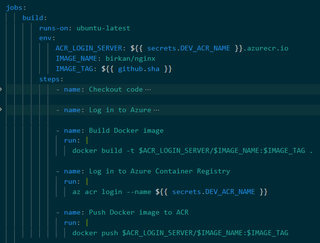
In build job, I am setting up my environment variables, then logging in
to the azure account via service provider (sp). Then I am building my
docker image from the dockerfile, I am setting the image name as
"birkan/nginx" and the tag as Git commit SHA for making sure it is
unique at each build.

After the image creation I am logging in to the azure container registry
to push the image.

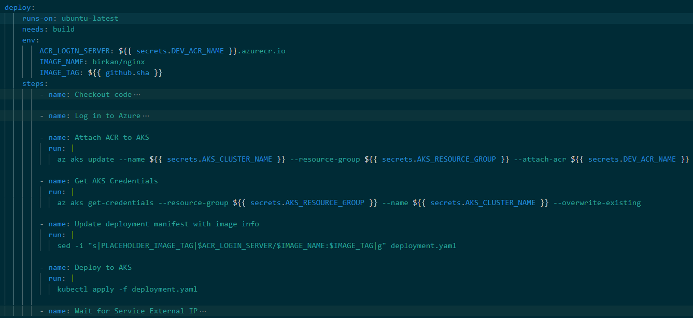

In the deploy job, I am first attaching the ACR to AKS. This step
ensures that AKS has permission to pull images from the ACR. Then I am
getting the AKS credentials to interact with the cluster. Then I am
updating the current deployment with the deployment I have just
prepared, replacing the placeholder I have set up before as
"PLACEHOLDER_IMAGE_TAG" with the actual image from the ACR.

At the end, after all steps are successfully one, I am waiting for the
external IP address to be available to visit my page.

Alternatively, I can go to the Azure portal, find my resource group for
AKS, find my Kubernetes load balancer and see my external IP address
there:

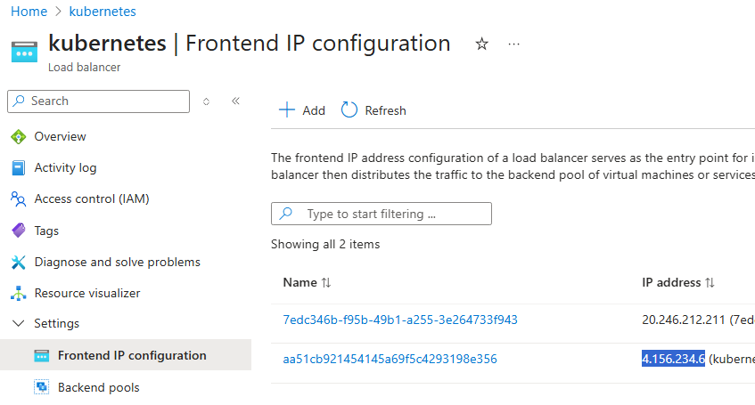

The whole pipeline takes roughly 5 minutes to run:

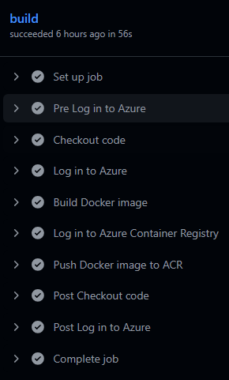
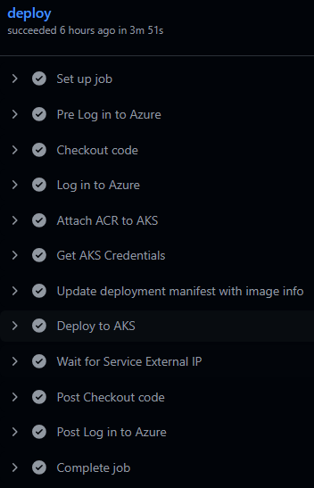

And this is the screenshot of my successfully deployed page:

# **Conclusion**

The purpose of the project to explore the best practices of provisioning
a cloud infrastructure as infrastructure as code (IAC) and successfully
deploy a simple web app to the Azure cloud automatically.

With this project I have practiced how automated infrastructure
provisioning is helping reduce human error and saves time for each
deployment to achieve agile practices in the team.

Thanks to these methods, the team is able to deploy new releases of the
application with no extra manual toil. Focusing their time and resources
only on the development part.
